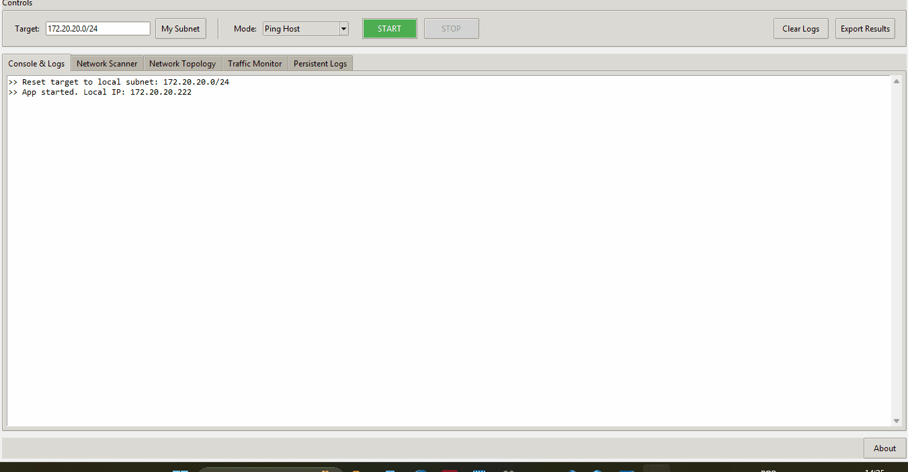

# PyNetSketch 📡
  PyNetSketch is a robust, Python-based network management and reconnaissance tool designed as a Proof of Concept (PoC) for students and network enthusiasts. It features a hybrid architecture combining a high-performance Rust core with a Python frontend (optional), and now supports a distributed mobile ecosystem.

Note: This project does not currently provide a full release executable.

## 🌟 Key Features
  * Hybrid Engine (Python + Rust): Critical scanning tasks are offloaded to a compiled Rust core for better execution performance.
  * Distributed Architecture (New!): operates in two modes: Standalone Desktop or Remote Probe Server for mobile clients.
  * Mobile Companion Support: Fully compatible with the PyNetSketch Mobile app for Android/iOS.
  * Multi-Mode Scanning:
    * Ping Host: Smart availability check using ICMP, falling back to TCP (Ports 80, 443, 53, 853) if blocked by firewalls.
    * Trace Route: TCP-SYN based traceroute to bypass standard ICMP blocks, featuring "Hidden Node" detection for firewalls/CGNAT.
    * Tracert (No DNS): traceroute mode that skips DNS resolution.
    * ARP Table Scan: Fast local subnet discovery with MAC Address and Vendor resolution.
    * Port Scan: Checks common TCP and UDP ports to identify open services.
  * Traffic Monitor: Real-time line graph visualizing network packet traffic.
  * Visual Topology Mapper: Automatically generates a "hub-and-spoke" diagram of subnets and devices, grouped by subnet gateways.
  * Wake-on-LAN (WoL): Wake up devices remotely via the right-click context menu.
  * Export Reports: Save scan findings to CSV or HTML reports.
  * Non-Blocking UI: All network tasks run in background threads, keeping the interface responsive.
    
## 🛠️ Modes
  * 🖥️ Standalone (GUI): The classic desktop experience. Runs the Tkinter GUI locally.
    * Best for: Local diagnostics, single-user scenarios.

  * 📡 Server (Remote Probe): Turns a machine into a network probe that listens for commands from any mobile devices running the companion app.
    * Auto-Discovery: Broadcasts its presence via UDP so mobile apps can find it instantly.
    * Remote Control: Accepts JSON commands (Ping, Scan, Trace) via TCP sockets from the mobile app.
    * Bypass Restrictions: Allows mobile devices to perform raw socket operations (like ARP scans) by offloading them to the PC.

## 📂 Project Structure
  * gui_app.py: Main entry point. Handles the Tkinter GUI, threading, and visualization logic.
  * net_utils.py: Contains raw socket and Scapy logic for scanning, pinging, and routing.
  * utils.py: Helper functions for logging and background thread management.
  * report_utils.py: Logic for exporting data to CSV/HTML.
  * assets/: Resources path.
  * LOGS/: Internal logging folder (auto creation).
  
  NOTE: This is subject to change as development moves forward.

## 🛠️ Prerequisites (development only)
  * Python 3.8+
  * Rust (optional, for compiling the core module): curl --proto '=https' --tlsv1.2 -sSf https://sh.rustup.rs | sh
  * ~~Npcap (Windows only): Required for Scapy to sniff/send packets. Download from nmap.org/npcap. Ensure you check "Install with WinPcap API-compatible Mode".~~
    * (v.1.2) - This requirement is now handled when initiating the application. Windows only.

## 📦 Installation
  Clone the repository:
    ```
    git clone https://github.com/yourusername/pynetsketch.git
    cd pynetsketch
    ```

  Install dependencies:
    ```
    pip install scapy requests pillow maturin
    ```
  Compile Rust Core (Optional for speedup):
    ```
    cd pynet_core maturin develop
    ```
  NOTE: This is subject to change as development moves forward.

## 🚀 Usage
  Running the Application
  
  Note: This application constructs raw network packets (ARP, TCP SYN). Administrator/Root privileges are necessary. Source code is open and available for review.
  
  Windows:
  
  Open PowerShell or Command Prompt as Administrator and run:
    ```
    python gui_app.py
    ```

  Linux/Mac:
    ```
    sudo python3 gui_app.py
    ```
    
  

## 🛠️ Version prototyping
  * v1.0 - Basic functionality. ARP Scan, Ping, Trcrt
  * v1.1 - Basic functionality. Monitor, Port Scan, Topology Draw, Exporting.
  * v1.2 - Solved dependency handling.
  * v1.3 - Optimization Update. Rust integration (Hybrid Engine), "No DNS" mode, Console Timer/Spinner.
  * v1.4 - Distributed Server Mode, Auto-Discovery Protocol, Mobile App Integration
  * v1.5 - Pre-release executable, fixes and error documentation.

## ⚠️ Known Limitations (v1.5 Debug)
<details>
<summary><strong>Click to expand</strong></summary>
  
### 1. Large Subnet Scans (The "Atomic Scapy" Issue)
**Symptom:** Scanning a `/16` network (65,536 hosts) causes the application to "freeze" or become unresponsive to the "STOP" button.

**Reason:** The current implementation passes the entire subnet to the underlying Scapy engine in a single atomic call. The Python Global Interpreter Lock (GIL) is held by the Scapy C-extensions until all packets are sent, preventing the GUI thread from interrupting the process.

**Workaround:** Scan smaller subnets (e.g., `/24`) or wait for the operation to complete.

**Future Fix:** Implement "Subnet Chunking" to break `/16` requests into 256 sequential `/24` scans, allowing for interruption between chunks. Implement visual feedback for each chunk.

### 2. Rust Module Cancellation Latency
**Symptom:** When running "Port Scan" or "TCP Ping" (Rust mode), clicking "STOP" does not halt the operation immediately.

**Reason:** The Rust `pynetsketch_core` module uses `Rayon` for parallel iteration. Currently, the parallel threads do not poll the Python stop-event flag during execution. The operation will stop only after the current batch of threads finishes their work.

**Future Fix:** Implement a shared `AtomicBool` or FFI callback to allow Python to interrupt the Rust thread pool instantly.

### 3. Logs Missing in Executable Mode
**Symptom:** When running the compiled `.exe` file, the `LOGS` folder does not appear next to the executable.

**Reason:** The application currently uses `os.path.abspath(__file__)` to determine the log location. In a PyInstaller "One-File" build, this path resolves to a temporary system directory (e.g., `%TEMP%/_MEIxxxx`) used by the bootloader, rather than the actual location of the `.exe` file.

**Workaround:** Logs are being generated, but they are buried in your system's temporary folder and deleted when the app closes.

**Future Fix:** Update the path detection logic to check for `sys.frozen` and use `sys.executable` (the exe path) instead of `__file__`.

### 4. Traffic Monitor shows "0 pps" (Flatline)
**Symptom:** The Traffic Monitor graph remains flat at 0 packets per second, even when the computer is actively using the internet.

**Reason:** The `monitor_traffic` function currently calls Scapy's `sniff()` without specifying an interface (`iface=None`). On Windows, Scapy often defaults to the Loopback adapter (`127.0.0.1`) or a virtual adapter (Hyper-V/VMware) instead of the active Wi-Fi/Ethernet card.

**Future Fix:** Apply the same route-based interface detection logic used in the ARP module to force `sniff()` to bind to the primary internet-facing adapter.
```
def monitor_traffic(interface=None, stop_event=None, progress_callback=None):
    utils._log_operation("Starting Traffic Monitor...")
    if progress_callback: progress_callback("Initializing Sniffer...")
    
    # TODO: BUG - WRONG INTERFACE SELECTION
    # Currently: sniff() defaults to conf.iface, which might be Loopback on Windows.
    # FIX: Auto-detect interface like in arp_scan:
    # try:
    #     route = conf.route.route("8.8.8.8")
    #     interface = route[0]
    # except: interface = None
    
    try:
        while not (stop_event and stop_event.is_set()):
            start_t = time.time()
            # If interface is None, it guesses (often wrongly on Windows)
            packets = sniff(timeout=1, count=0, iface=interface) 
            count = len(packets)
            # ... rest of loop ...
```
</details>

## 📱 Mobile App
  To control this tool from your phone, download the [PyNetSketch Mobile App](https://github.com/KretliJ/PyNetSketch_Mobile) (Flutter).
  
## 📜 License
  This project is licensed under the MIT License.

## ⚠️ Disclaimer
  This tool is intended for Educational Purposes Only (my own or otherwise). 
  
  Please use it only on networks you own or have explicit permission to scan. The developer assume no liability for misuse.

  I don't want to make you stop using advanced tools, I want to show you the way towards them.
  
  Built with ❤️ using Python, Tkinter & Rust.

<details><summary><b>Extras for software engineering nerds (such as me)</b></summary></details>
