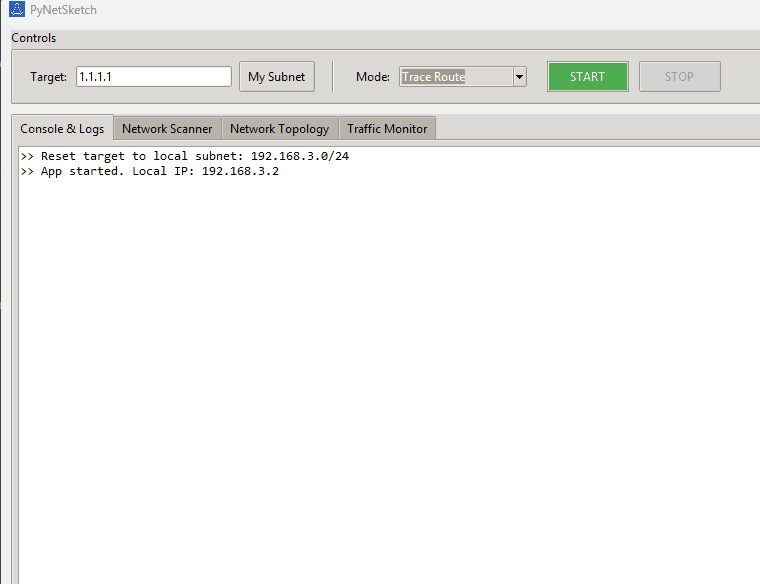

# PyNetSketch 📡
  PyNetSketch is a robust, Python-based network management and reconnaissance tool designed as a Proof of Concept (PoC) for students and network enthusiasts. It combines scanning capabilities with a user-friendly GUI to visualize network topologies and traffic in real-time.

Note: This project does not currently provide a pre-compiled executable.

### 🌟 Key Features
  * Hybrid Engine (Python + Rust): Critical scanning tasks are offloaded to a compiled Rust core for better execution performance.
  * Multi-Mode Scanning:
    * Ping Host: Smart availability check using ICMP, falling back to TCP (Ports 80, 443, 53, 853) if blocked by firewalls.
    * Trace Route: TCP-SYN based traceroute to bypass standard ICMP blocks, featuring "Hidden Node" detection for firewalls/CGNAT.
    * Tracert (No DNS): traceroute mode that skips DNS resolution.
    * ARP Table Scan: Fast local subnet discovery with MAC Address and Vendor resolution (via api.macvendors).
    * Port Scan: Checks common TCP and UDP ports to identify open services.
  * Traffic Monitor: Real-time line graph visualizing network packet traffic.
  * Visual Topology Mapper: Automatically generates a "hub-and-spoke" diagram of subnets and devices, grouped by subnet gateways.
  * Wake-on-LAN (WoL): Wake up devices remotely via the right-click context menu.
  * Export Reports: Save scan findings to CSV or HTML reports.
  * Non-Blocking UI: All network tasks run in background threads, keeping the interface responsive.
    
### 🛠️ Modes
  * Ping Host: Enter an IP (e.g., 8.8.8.8) to check latency and status.
  * Trace Route: Enter an IP to see the hop-by-hop path.
  * Tracert no DNS: path tracing without hostname lookups.
  * ARP Scan: Enter a subnet (192.168.1.0/24) or a range (192.168.1.0/24-192.168.10.0/24) to find all local devices.
  * Port Scan: Enter a specific IP to scan for open services.
  * Traffic Monitor: Select this mode to view the live traffic graph.

### 📂 Project Structure
  * gui_app.py: Main entry point. Handles the Tkinter GUI, threading, and visualization logic.
  * net_utils.py: Contains raw socket and Scapy logic for scanning, pinging, and routing.
  * utils.py: Helper functions for logging and background thread management.
  * report_utils.py: Logic for exporting data to CSV/HTML.
  * assets/: Resources path.
  * LOGS/: Internal logging folder (auto creation).
  
  NOTE: This is subject to change as development moves forward.

### 🛠️ Prerequisites
  * Python 3.8+
  * Rust (optional, for compiling the core module): curl --proto '=https' --tlsv1.2 -sSf https://sh.rustup.rs | sh
  * ~~Npcap (Windows only): Required for Scapy to sniff/send packets. Download from nmap.org/npcap. Ensure you check "Install with WinPcap API-compatible Mode".~~
    * (v.1.2) - This requirement is now handled when initiating the application.

### 📦 Installation
  Clone the repository:
    ```
    git clone https://github.com/yourusername/pynetsketch.git
    cd pynetsketch
    ```

  Install dependencies:
    ```
    pip install scapy requests pillow maturin
    ```
  Compile Rust Core (Optional for speedup):
    ```
    cd pynet_core maturin develop
    ```
  NOTE: This is subject to change as development moves forward.

### 🚀 Usage
  Running the Application
  
  Note: This application constructs raw network packets (ARP, TCP SYN). Administrator/Root privileges are necessary. Source code is open and available for review.
  
  Windows:
  
  Open PowerShell or Command Prompt as Administrator and run:
    ```
    python gui_app.py
    ```

  Linux/Mac:
    ```
    sudo python3 gui_app.py
    ```

  
  
  
### 🛠️ Version prototyping
  * v1.0 - Basic functionality. ARP Scan, Ping, Trcrt
  * v1.1 - Basic functionality. Monitor, Port Scan, Topology Draw, Exporting.
  * v1.2 - Solved dependency handling.
  * v1.3 - Optimization Update. Rust integration (Hybrid Engine), "No DNS" mode, Console Timer/Spinner.
 
### 📜 License
  This project is licensed under the MIT License.

### ⚠️ Disclaimer
  This tool is intended for Educational Purposes Only (my own or otherwise). 
  
  Please use it only on networks you own or have explicit permission to scan. The developer assume no liability for misuse.
  
  Built with ❤️ using Python, Tkinter & Rust.

<details><summary><b>Extras for software engineering nerds (such as me)</b></summary></details>
